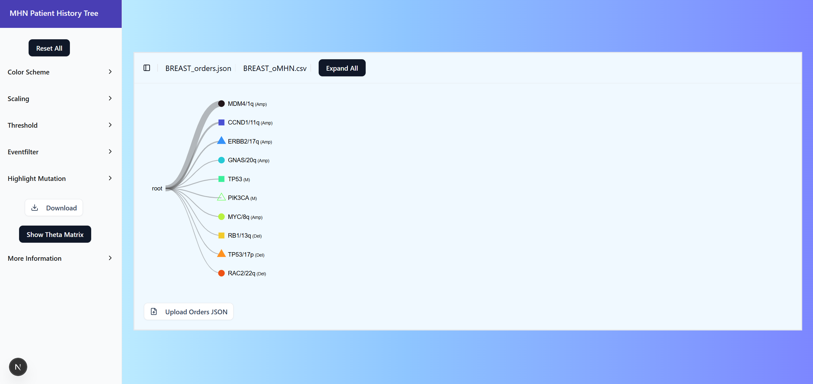

<div align="center">
  <h1>🧬 MHN Patient History Tree Application 🌳</h1>
  <p><i>Visualize Genetic Event Histories in Tumors using Mutual Hazard Networks (MHNs)</i></p>
</div>



<picture>
  
</picture>


# About the Project 💻	

This project is an **interactive web application** to dynamically visualize MHN Patient History Trees, making it much easier to explore tumor evolution pathways in real time.

The web application allows users to upload and visualize MHN-inferred genetic event orders (History Trees) in tumors from CSV and JSON files. It is designed for scientists in biology, oncology, and bioinformatics, with or without programming background.


## What is MHN?	

The **Mutual Hazard Networks (MHNs) Algorithm** is a Cancer Progression Model (CPM) that takes into account both **promoting and inhibitory relationships** between genetic events as well as **cyclic dependencies**, enabling the reconstruction of **the most likely tumor evolution path for every tumor** in patient data. These paths can be visualized in History Trees 🌳.

<ins>The algorithm generates two files: </ins>
<!-- Eine Quelle zu den Bäumen noch einfügen (Figure in einem Paper) -->

### 📄 CSV - Theta Matrix

The CSV contains:
- **multiplicative effects** between genetic events, promoting as well as inhibitory
- the **base rate** (natural likelihood) of each genetic event to occur
- the **observation rate** (likelihood for the presence of a genetic event to lead to clinical detection of the tumor)


###  📄 JSON - History Tree

Based on the Theta Matrix, the algorithm infers the **order of occurence** of genetic events for History Tree, which is stored in the corresponding JSON file.


## Features

:heavy_check_mark: Theta matrix display of relationships between genetic events

:heavy_check_mark: Visualization of MHN-based tumor development as an interactive tree

:heavy_check_mark: Customizable view: threshold, eventfilter, scaling of edges, coloring, tooltip information, expand all button

:heavy_check_mark: Upload JSON files for History Tree view and CSV files for vizualisation of Theta Matrix

:heavy_check_mark: Download SVG of History Tree

## Tech Stack 🔧

Here's a brief high-level overview of the tech stack the MHN History Tree application uses:

- This is a [Next.js](https://nextjs.org) project bootstrapped with [`create-next-app`](https://nextjs.org/docs/app/api-reference/cli/create-next-app).

- The History Tree is vizualized by using the package [D3.js](https://d3js.org/) with the [Collapsible Tree](https://observablehq.com/@d3/collapsible-tree) template.

- The Theta Matrix is vizualized by using the package [D3.js](https://d3js.org/) with the [Heatmap with tooltip](https://d3-graph-gallery.com/graph/heatmap_tooltip.html) template.

- To ensure a consistent and visually appealing user interface, the UI component library [shadcn/ui](https://ui.shadcn.com/) was used. 

- For code safety, [TypeScript](https://www.typescriptlang.org/) was used. 

##	📋 Getting Started 

### ❗Requirements 

- Node.js (version 18 or later) [Node.js download](https://nodejs.org/en/download)
- npm (included in Node.js download) - package manager
- modern web browser (for example, Google Chrome or Mozilla Firefox)

### Download Project

 1. Click the **green code button** button and select **Download ZIP** 
 2. Extract the ZIP file:  Right-click → **Extract All**

 ### Start Project

 1. Open a terminal in the **unpacked project folder**  
   - Right-click the folder → **Open in Terminal**  
   - Or open a terminal manually and navigate to the folder using `cd`:

   **Example for Windows**
   ```bash
   cd C:\Users\admin\Downloads\historytree
  ```
   
   **Example for macOS**
   ```bash
   cd ~/Downloads/historytree
  ```

  2. Install dependencies
   ```bash
  npm install
  ```

  3. Start the application
  ```bash
  npm start
  ```
   4. Open the application in your browser using the URL: 
  ```bash
  http://localhost:3000
  ```

   5. To stop the application press:
   ```bash
   Ctrl + C (Windows)
   # or
   Control + C (macOS)
  ```


## 📚Learn More

[Schill et al., 2019](https://doi.org/10.1093/bioinformatics/btz513)

[Schill et al., 2023](https://doi.org/10.1101/2023.12.03.569824)


## User Guide


### Coloring

Change the color scheme


### Event Filtering

Visualize specific genetic events


### Highlight Paths

Select a specific genetic event and highlight all paths in the tree that include it.


### Scaling Edges

Adjust the stroke width of the edges linearly to the patient count. 


### Threshold

Filter data based on a minimum patient count. 


<details>

<summary>Tips for collapsed sections</summary>

### You can add a header

You can add text within a collapsed section.

You can add an image or a code block, too.

```ruby
   puts "Hello World"
```

</details>


